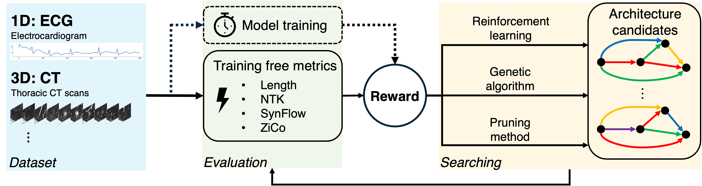

# TEACUP: Training-free Assembly as Clinical Uncertainty Predictor

TEACUP is a fast and accurate framework for automated clinical deep learning that characterized the quality of deep networks without training.



## Getting Started

### Prerequisites
You will need to download AMBER and switch to the branch specifically designed for our project.
```
git clone https://github.com/zj-zhang/AMBER.git
cd AMBER
git checkout ntk
```
Then, please add `amber` to your Python path.

### Installation
1. Clone the repo
```
git clone git@github.com:zhanglab-aim/TEACUP.git
```
2. Install conda environments
```
cd TEACUP
conda create -n teacup conda.yml
```
3. Install further packages
```
conda activate teacup
pip install thop medmnist
```

### Data Downloading
For ECG data, please download the file `ecg/challenge2017.pkl` from [this link](https://drive.google.com/drive/folders/1OOp6UrCiP79mTIkCrUdjjHWDo8K0bJUw). The dataset is provided from [NAS-Bench-360](https://nb360.ml.cmu.edu/).
Then, make a `dat/nas-bench-360` folder to store the file.
```
mkdir -p data/nas-bench-360
mv [location of challenge2017.pkl] data/nas-bench-360/
```

For CT data, it will be automated downloaded by `medmnist` package. No further action needed.

## Run TEACUP

### Reinforcement Learning
```
python run_genetic.py --dataset ECG2017 --store results --verbose
python run_genetic.py --dataset NoduleMNIST3D --store results --verbose
```

### Genetic Algorithm
```
python run_genetic.py --dataset ECG2017 --store results --verbose
python run_genetic.py --dataset NoduleMNIST3D --store results --verbose
```

### Pruning Method
```
python run_pruning.py --dataset ECG2017 --store results --verbose
python run_pruning.py --dataset NoduleMNIST3D --store results --verbose
```

## Contact
If you encounter any issues and/or would like feedbacks, please leave a [GitHub issue](https://github.com/zhanglab-aim/TEACUP/issues). We will try to get back to you as soon as possible.